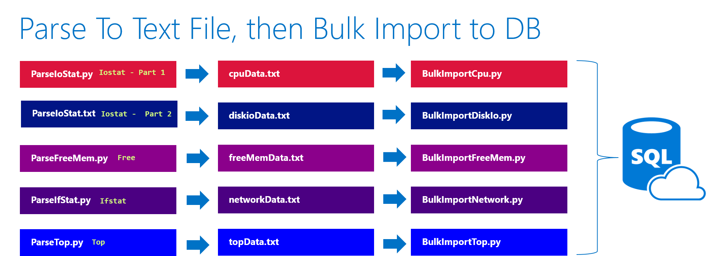

# Linux Perfmon

This is a project about bringing the power from Windows Perfmon tool to the Linux world. Well, it is more than that. You can bring any analytic and visualization to the core tools provided here.

This examples get dozeens of performance metrics in SQL Database. Could it upload to MySQL or PostGres? Yes, with some slight tweaks. You could argue it makes sense in a time series database. Yes, that would work too.

The code here simply removes all the grunt work of getting core performance metrics into a persistent datastore through a concrete example.

## Established Linux performance monitoring tools

By leveraging well-known and established Linux utilities such as top, iostat (and more), we can use proven tooling in the platform in vendor independent manner. This means you can run these utilities in any known public cloud, as well as on premises computers.
Current architecture
The architecture is decoupled, and flexible in terms of how performance metrics get captured, transformed/stored, and charted/analyzed.

## Local file system for performance metrics storage

Because the capture process stores to local text files, there is less interference and corruption of the performance metrics as data is captured.
Upload performance metrics to relational database
The uploading of the data into the cloud is done after the capture process has been halted. At that point, text files are read by Python applications, and with minimal transformations, or uploaded to a persistent store is currently SQL Server. 

## Minimize dependencies

The only lead dependency on the Linux side is Python itself. Many distributions now include Python regardless and upgrading to version 3 is simply one command.
Perfmon, Python, SQL Server, Excel to start with
The current set of tooling for the entire package include: Python, SQL Server, optionally, Excel for the visualization side. Because Windows Perfmon can take input from a relational database, integration with it as a visualizer is amazingly easy.

## Potential improvements

There are many ideas for making this a better product. One improvement could be leveraging open source charting packages like Grafana.

- https://grafana.com/

## Power BI

There is also the potential for using Power BI, which is not an open source tool, but may make sense for some who would like to integrate cleanly with SQL Server.

## More recommended improvements provided later

More details about architectural improvements to this package will be provided soon.

### You can see all the code here:
https://github.com/brunoterkaly/linux-perfmon/

# Overview - How the pieces fit together

- **Installation** – run **InstallPython.sh** to get things rolling. From there, run **python3 Install.py**
- **Starting the capture** – run **StartCapture.sh**. This batch script will run a variety of other scripts:   
	- ParseFreeMemStat.py 
	- ParseIfStat.py
	- ParseIoStat.py
	- ParseTop.py 
- **Capture and save** - the Python scripts above simply execute the Linux utilities and scrape the output from the screen. . This output gets then saved into delimited text files, later to be inserted into SQL Server for analysis and charting.
	- Some screen scraping happens and this data is saved as text files:
		- cpuData.txt
		- diskioData.txt
		- freeMemData.txt
		- networkData.txt
		- topData.txt 
- **The Linux utilities** - be that each of the Python scripts calls a lower level Linux function:
	- **ParseIoStat.py**
		- command = ['iostat']
	- **ParseFreeMemStat.py**
		- command = ['free']	
	- **ParseIfStat.py**
		- command = ['ifstat', '-bt']
	- **ParseTop.py**
		- command = ['top', '-b', '-n1']
- **Stopping the capture and loading the data to a database** - after some period of time when you have completed capturing the performance metrics by running **StopCapture.py**, which will:
	- Halt the capture process
	- Read the generated text files and upload them to SQL database in the cloud
- **BulkImportCode** - There are a number of Python scripts that perform the reading of these disk-based text files, and uploading that data up into SQL Database.
	- BulkImportCpu.py
	- BulkImportDiskIo.py
	- BulkImportFreeMem.py
	- BulkImportNetwork.py
	- BulkImportTop.py  
- **Understanding the code** - a connection string is needed to connect up to your database. The name of this file that stores the connection string is called, **fakeconnectionstrings.txt**. If you need to create the database from scratch, the entire sequence of SQL commands can be found in the file, **database-creation-script.sql.**
- **The database**- there is a significant amount of transformation logic in the database today. The logic is expressed both with SQL views as well as SQL stored procedures. Ultimately,  we talking about timeseries data so it could be argued that other databases might fit better. The original developer had quick and easy access it to SQL database along with some of the logic that was used. So it became the choice database. Some of the logic includes the ability to transform rows and columns for easier charting.
- **The spreadsheet** - There is an **a** that does an import from the database, as well as generating some charts. It is still under development and has been included in this repot yet.

## Summary

The "Parse" scripts below run the Linux utilities and output text files during the capture process. These text files are then read by the "Bulk" Python scripts and uploaded to the SQL database in the cloud.

